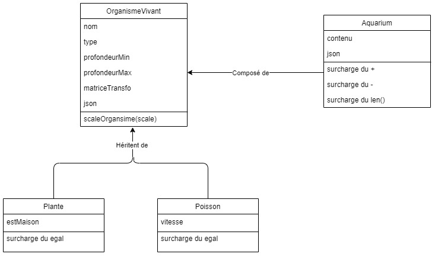
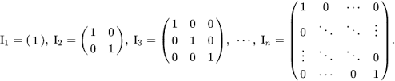
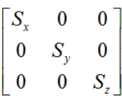

# TP3

#### :alarm_clock: [Date de remise le vendredi 24 juin 2022 à 23h59]

## Objectif

Ce TP a pour objectif de pratiquer les tests et outils de correction, les bibliothèques scientifiques et graphiques, les classes et objets, l'héritage et le polymorphisme.

## Critères d'évaluation

Une démarche de qualité et un bon résultat donnent la note maximale. Une erreur minime (ex faute de frappe) mènera à une pénalité de 0.5 points. Puisqu'il s'agit d'un cours de programmation, une attention particulière sera accordée à la qualité du code. La note possible maximale du TP est 100%.

**On souhaite utiliser la librairie abc et les décorateurs aux endroits appropriés.**
Un code qui ne roule pas est un 0 automatique, alors testez votre code!!

N'oubliez pas de jeter un oeil aux erreurs courantes de qualité de code dans le fichier [QualiteCode.md](./ressources/QualiteCode.md)

## Rouler le code

Pour ce TP, on aura besoin de la librairie numpy, qui est excellente pour gérer les opérations matricielles et les tableaux. Si vous continuez de travailler en Python après ce cours, c'est un indipensable! On peut l'installer en roulant la commande:

```cmd
conda install numpy
```

OU

```cmd
pip install numpy
```

NOTE: Il se peut que vous l'ayez déjà installée suite au TP2

## Mise en Contexte

On se prépare pour un voyage en sous-marin, afin d'aller étudier la faune sous-marine de la _fosse abstraite_. On veut au préalable faire la liste des poissons qu'on risque d'aperçevoir afin de savoir à quoi s'attendre.

Voici un schéma qui décrit comment le projet est structuré:


# Partie 1 - La classe OrganismeVivant

On veut tout d'abord implémenter la classe abstraite de base OrganismeVivant dans le fichier `organismeVivant.py`, qui représente un organisme sous-marin de base.

Le constructeur de la classe organismeVivant doit pouvoir prendre en entrée un string représentant le nom, un int représentant la profondeurMin et un int représentant la profondeurMax.

Les attributs de la classe sont nom, type (qui doit toujours valoir TYPE_ORGANISME), profondeurMin, profondeurMax, et matriceTransfo. On voudra valider que profondeurMin < profondeurMax et que la différence entre les deux est d'au moins 10! En cas d'erreur, on assignera la valeur de profondeurMax à celle de profondeurMin + 10.

L'attribut matriceTransfo doit être un tableau numpy initialisé à une matrice identité de taille 3. Elle représentera les transformations (scale) qu'on appliquera sur l'organisme. Une matrice identité a la forme suivante (dépendant de la taille n):


On voudra également définir la propriété abstraite json, qui est un dictionnaire représentant le contenu de l'objet. Il est à noter que la matrice de transformation numpy devrait être convertie en liste dans le dictionnaire. On veut encoder les attributs nom, type, profondeurMin, profondeurMax, et matriceTransfo sous la forme suivante:

```Python
{
    "nom" : nom de l\'organisme,
    "type" : type de l\'organisme
    "profondeurMin" : profondeurMin de l\'organisme
    "profondeurMax" : profondeurMax de l\'organisme
    "transformation": matrice de transformation de l\'organisme
}
```

Finalement, on voudra implémenter la méthode de classe scaleOrganisme, qui prend en entrée un float représentant un facteur parlequel on voudra faire grossir l'organisme.

On voudra donc tout d'abord définir notre matrice de Scale selon la forme suivante:



On doit noter que pour nous, Sx = Sy = Sz = le facteur pris en entrée

Puis, on voudra appliquer cette matrice à notre matrice de transformation avec l'équation suivante:
matrice transfo updatee = matrice de Scale x matrice transformation originale

N'oubliez pas que l'ordre des multiplications matricielles est important!

# Partie 2 - La classe Plante

Dans le fichier `plante.py`, on veut créer la classe Plante, qui décrira les plantes que nous croiserons pendant notre voyage. Plante hérite d'OrganismeVivant. Le constructeur de la classe plante prends les mêmes paramètres en entrée que le constructeur de la classe OrganismeVivant, en plus d'un booléen qui indique si des poissons peuvent utiliser la plante comme habitat. Aussi, le type d'un objet plante est TYPE_PLANTE.

On voudra donc surcharger la propriété absraite JSON pour qu'elle retourne un objet de forme:

```Python
{
    "nom" : nom de la plante,
    "type" : type de la plante,
    "profondeurMin" : profondeurMin de la plante,
    "profondeurMax" : profondeurMax de la plante,
    "estMaison": si la plante peut servir d\'habitat,
    "transformation": matrice de transformation de la plante
}
```

On voudra également surcharger l'opérateur égal de la classe pour qu'on puisse comparer la plante avec n'importe quel organismeVivant. Une plante est égale à un organisme si les deux sont de type Plante, et si tous leurs attributs sont égaux en valeur.

# Partie 3 - La classe Poisson

Dans le fichier `poisson.py`, on veut créer la classe Poisson, qui décrira les poissons que nous croiserons pendant notre voyage. Poisson hérite d'OrganismeVivant. Le constructeur de la classe Poisson prends les mêmes paramètres en entrée que le constructeur de la classe OrganismeVivant, en plus d'un float qui indique la vitesse du poisson. Aussi, le type d'un objet plante est TYPE_POISSON.

On voudra donc surcharger la propriété absraite JSON pour qu'elle retourne un objet de forme:

```Python
{
    "nom" : nom du poisson,
    "type" : type du poisson,
    "profondeurMin" : profondeurMin du poisson,
    "profondeurMax" : profondeurMax du poisson,
    "vitesse": la vitesse du poisson,
    "transformation": matrice de transformation du poisson
}
```

On voudra également surcharger l'opérateur égal de la classe pour qu'on puisse comparer la plante avec n'importe quel organismeVivant. Une plante est égale à un organisme si les deux sont de type Plante, et si tous leurs attributs sont égaux en valeur.

# Partie 4 - La classe Aquarium

Dans le fichier `aquarium.py`, on veut créer la classe Aquarium, qui représente toutes les créatures qu'on rencontrera dans les fonds marins.  La classe ne prends rien en paramètre lors de son initialisation, mais elle a comme attribut de classe une liste représentant le contenu de l'environnement (qui est vide au début).

On voudra aussi définir la propriété json, qui retourne un objet qui est la représentation sous forme de dictionnaire du contenu de l'aquarium. Le dictionnaire a la forme suivante:

```Python
{
    "aquarium" : {
        "poissons": [ une liste des représentation json de chaque poisson de l\'aquarium],
        "plantes": [ une liste des représentation json de chaque plante de l\'aquarium]
    }
}
```

Finalement, on voudra surcharger les opérateurs suivants:

- Opérateur +: On veut pouvoir ajouter facilement un Poisson ou une Plante au contenu de notre Aquarium
- Opérateur -: On veut pouvoir retirer facilement un Poisson ou une Plante au contenu de notre Aquarium
- Operateur len(): On veut pouvoir obtenir la taille de notre Aquarium, soit la taille de son contenu

# Partie 5 - Le main

Le fichier main est `main.py`, et on le roulera avec la commande:

```Python
python main.py
```

Il vous faudra compléter le main selon les étapes suivantes
    - Instancier un aquarium
    - Créer au moins 3 poissons
    - Agrandir un des poissons
    - Ajouter les poissons à l'aquarium en les additionnant
    - Enlever un poisson à l'aquarium en le soustrayant
    - Créer au moins 2 plantes
    - Ajouter les plantes à l'aquarium en les additionnant
    - Afficher taille aquarium
    - Écrire le contenu de l'aquarium dans le fichier OUT_FILE (format JSON)

Un fichier exampleOut.json vous est fourni, c'est un exemple du format de fichier auquel on s'attend.
La profondeur min et max et le scale par lequel vous agrandissez vos poissons est à votre discrétion. Les organismes DOIVENT avoir un nom tiré du fichier `constantes.py`

# Partie 6 - Les tests

Et oui, encore des tests ;) On voudra vous faire tester certaines méthodes de classe. Comme pour le Projet 2, le contenu des tests est laissé à votre discrétion, mais faites en sorte de tester les cas limites! Le fichier test est `tests.py`

Les fonctions à tester sont les suivantes:
    - On veut tester la fonction scale d'organismeVivant
    - On veut tester l'égalité des Poissons
    - On veut tester l'égalité des Plantes
    - On veut tester l'addition, la soustraction et la fonction qui retourne la taille de l'Aquarium
